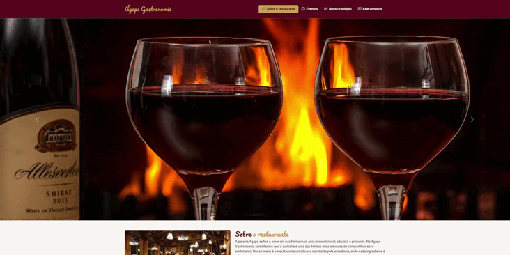

> 👉 **Acesse aqui:**  
>🔗 https://agape-restaurante.vercel.app/
> ## 🎬 Demonstração
> 
---

# Ágape Gastronomia

O **Ágape Gastronomia** é um projeto de site institucional voltado para o ramo alimentício, desenvolvido com foco em design elegante, usabilidade e uma experiência de usuário fluida. O projeto busca transmitir a essência do "amor à mesa" através de uma interface acolhedora e moderna.

## 🚀 Tecnologias Utilizadas

Este projeto foi construído utilizando tecnologias robustas de front-end:

* **HTML5:** Estruturação semântica e organizada.
* **CSS3:** Estilização personalizada com foco em uma identidade visual premium.
* **Bootstrap 5.3:** Framework CSS para responsividade, grid system e componentes dinâmicos (Navbar, Carrossel, Tabs).
* **Google Fonts:** Tipografia selecionada (Pacifico e Roboto) para reforçar a identidade da marca.
* **Bootstrap Icons:** Biblioteca de ícones para compor o visual.

## 🎨 Identidade Visual

A paleta de cores foi pensada para remeter ao clássico e ao contemporâneo:
* **Borgonha (`#5d0e1d`):** Cor principal, transmitindo sofisticação.
* **Ouro (`#c5a059`):** Cor de destaque, utilizada para guiar a atenção do usuário.
* **Creme (`#f9f7f2`):** Fundo que proporciona conforto visual e uma experiência de leitura agradável.

## 💡 Principais Funcionalidades

* **Navegação Fluida:** Menu interativo com *scroll* suave para rápida transição entre as seções.
* **Cardápio Dinâmico:** Organização por categorias utilizando *Tabs* do Bootstrap, permitindo uma visualização limpa de bebidas, entradas, pratos principais e sobremesas.
* **Responsividade:** O layout se adapta perfeitamente a dispositivos móveis, tablets e desktops.
* **Formulário de Contato:** Estruturado com validação nativa do HTML5.
* **Carrossel de Imagens:** Exposição visual do ambiente e dos pratos do restaurante.

## 🛠️ Como rodar o projeto

1.  Clone este repositório:
    ```bash
    git clone [https://github.com/SEU_USUARIO/agape-gastronomia.git](https://github.com/SEU_USUARIO/agape-gastronomia.git)
    ```
2.  Abra o arquivo `index.html` no seu navegador de preferência.

## 📁 Estrutura de Pastas

```text
/
├── images/           # Imagens de pratos, ambientação e slides
├── main.css          # Estilos personalizados
├── index.html        # Estrutura principal do site
└── README.md         # Documentação
 ```
✒️ Autor
Projeto desenvolvido por Willians Martins, visando aplicar boas práticas de desenvolvimento web full stack e design de interface.
